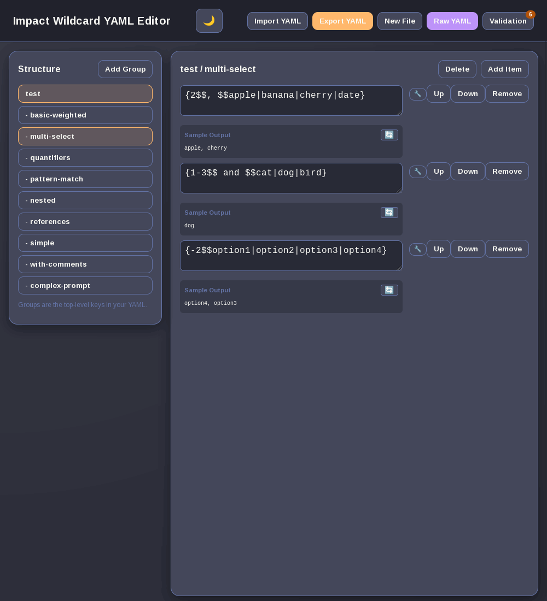

# Wildcard Creator

A simple web editor for creating and managing wildcard files like those used by ComfyUI-Impact-Pack.

## What it does

- Edit YAML wildcard files in your browser
- Visual editor with pattern helpers
- Validation that catches common mistakes
- Test your wildcards and see sample outputs

## Installation

### Option 1: Download ZIP
1. Download the [latest version](https://github.com/Taithrah/wildcard-creator/archive/refs/heads/main.zip)
2. Extract the ZIP file to your desired location
3. Open `wildcard-editor.html` in your browser

### Option 2: Clone the repository
1. ```git clone https://github.com/Taithrah/wildcard-creator.git```
2. Navigate to the cloned directory
3. Open `wildcard-editor.html` in your browser

## How to use

Just open `wildcard-editor.html` in your browser. No server, no install, no fuss.

Import your existing YAML files or start fresh. When you're done, hit export and you're good to go.


